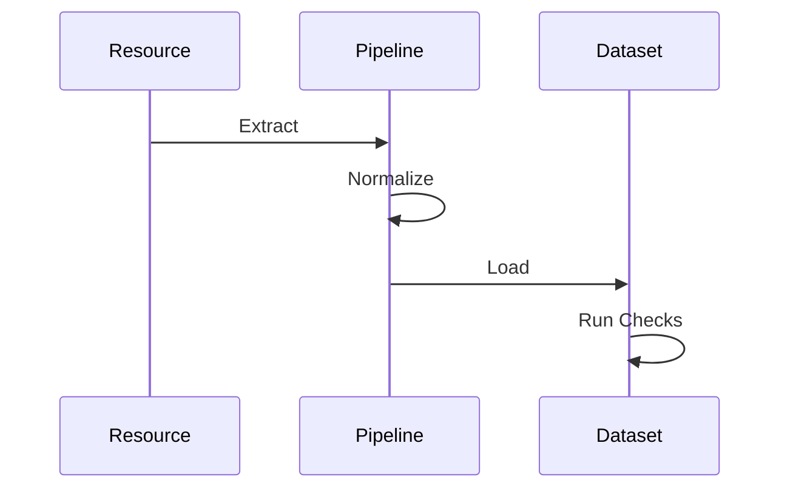
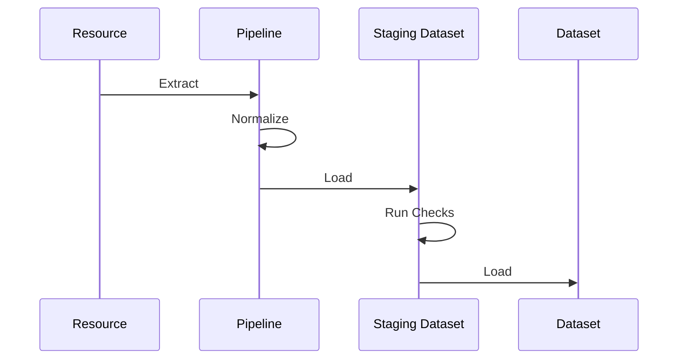
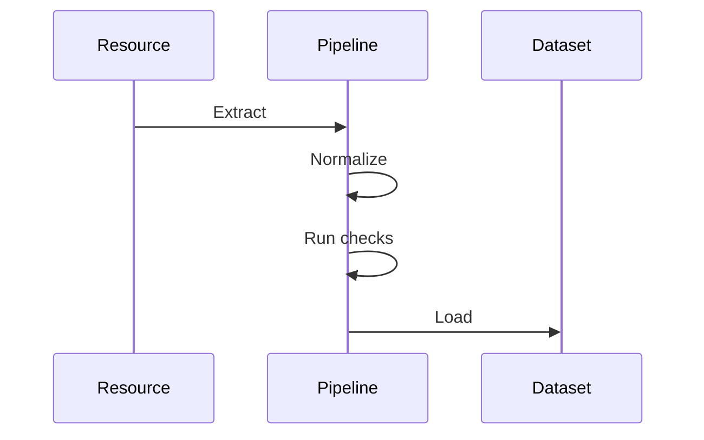

:::warning
This feature is in public preview
:::

dltHub data quality features include metrics for monitoring dataset properties over time, and checks to validate them against expectations. Together, they offer visibility and help catch data issues early. Metrics and checks are defined via Python code. The extensive configuration allows you to specify what to monitor and validate, when, how, and where to store results.

This page covers the basics of metrics and checks. You should notice a lot of symmetry (for example, `with_metrics()` and `with_checks()`). The later parts of this page cover notions applicable to both. 

## Metrics

A **data quality metric** or **metric** a function applied to data that returns a scalar value describing a property of the data. A metric can take as input a column, a table, or the full dataset (i.e., all tables and historical metrics).

### Define metrics
#### Static

You can define metrics along your `@dlt.resource` (and `@dlt.transformer`, `@dlt.hub.transformation`) via the new decorator `@with_metrics`. It's available under the `dlt.hub.data_quality` module, commonly imported as `dq`. Inside the decorator, you can set the individual metrics available through `dq.metrics.column.`, `dq.metrics.table.`, or `dq.metrics.dataset.`.

The next snippet defines 3 metrics on the `customers` resource: the mean of the `amount` column, the number of null values in the `email` column, and the total number of rows in the table. 

:::note
Only column-level and table-level metrics can be defined on a `@dlt.resource`. To set dataset-level metrics, use `@with_metrics` on the `@dlt.source`.
:::


```python
import dlt
from dlt.hub import data_quality as dq

@dq.with_metrics(
    dq.metrics.column.mean("amount"),
    dq.metrics.column.null_count("email"),
    dq.metrics.table.row_count()
)
@dlt.resource
def customers():
    yield data
```

The next snippet shows how to add dataset-level metrics to a source. The `total_row_count` is added on the `crm` source.

```python
import dlt
from dlt.hub import data_quality as dq

@dq.with_metrics(
    dq.metrics.column.mean("amount"),
    dq.metrics.column.null_count("email"),
    dq.metrics.table.row_count()
)
@dlt.resource
def customers():
    yield data


@dq.with_metrics(
    dq.metrics.dataset.total_row_count()
)
@dlt.source
def crm():
    return [customers]
```

#### Dynamic

Similar to the static approach, you can add metrics to an instantiated resource or source object using `with_metrics`. This is particularly useful when using built-in sources and resources like `filesystem`, `rest_api` or `sql_database`.

```python
import dlt
from dlt.hub import data_quality as dq

@dlt.resource
def customers():
    yield from [...]

# later; this mutates the resource object and sets metrics
dq.with_metrics(
    customers,
    dq.metrics.column.mean("amount"),
    dq.metrics.column.null_count("email"),
    dq.metrics.table.row_count()
)
```

### Available metrics

Here's the list of built-in metrics:

```python
from dlt.hub import data_quality as dq

# column-level
dq.metrics.column.maximum("col")
dq.metrics.column.minimum("col")
dq.metrics.column.mean("col")
dq.metrics.column.median("col")
dq.metrics.column.mode("col")
dq.metrics.column.sum("col")
dq.metrics.column.standard_deviation("col")
dq.metrics.column.quantile("col", quantile=0.95)
dq.metrics.column.null_count("col")
dq.metrics.column.null_rate("col")
dq.metrics.column.unique_count("col")
dq.metrics.column.average_length("col")
dq.metrics.column.minimum_length("col")
dq.metrics.column.maximum_length("col")

# table-level
dq.metrics.table.row_count()  # Number of rows in table
dq.metrics.table.unique_count()  # Number of distinct / unique rows in table
dq.metrics.table.null_row_count()  # Number of rows where all columns are null

# dataset-level
dq.metrics.dataset.total_row_count()  # Total number of rows
dq.metrics.dataset.load_row_count()  # Rows added in latest load
dq.metrics.dataset.latest_loaded_at()  # Timestamp of most recent load
```

:::note
If you have built-in metrics requests, let us know. Custom metrics are planned.
:::

### Compute metrics

After loading data, call `dq.run_metrics()` on your pipeline to compute every metric registered via `@with_metrics` and persist the results to the destination:

```python
pipeline = dlt.pipeline("my_pipeline", destination="duckdb")
pipeline.run(customers)

# compute metrics and persist them to the destination
dq.run_metrics(pipeline)
```

`run_metrics` is dispatched on the argument type — pass either the pipeline or a `dlt.Dataset`:

```python
# alternative: compute metrics against the loaded dataset
# (for example, after re-attaching from another script or notebook)
pipeline = dlt.attach("my_pipeline")
dq.run_metrics(pipeline.dataset())
```

:::note
Each call to `run_metrics` writes a fresh snapshot to the `_dlt_dq_metrics` table — one row per registered metric, with columns `_dlt_load_id`, `loaded_at`, `table_name` (null for dataset-level metrics), `column_name` (null for table- and dataset-level metrics), `metric_name`, and the computed `metric_value`. Successive calls append; nothing is overwritten.
:::


### Read metrics

The convenience function `dq.read_metric()` allows you to retrieve stored metrics with some metadata. This makes it easy to build reporting, dashboard, or analytics over this data.

The function produces a `dlt.Relation` which can be converted to a list, pandas dataframe, arrow table, etc.

```python
dataset = pipeline.dataset()
# column-level `mean` as pandas.DataFrame
dq.read_metric(
    dataset, 
    table="customers", 
    column="amount", 
    metric="mean"
).df()

# table-level `row_count` as list of tuples
dq.read_metric(
    dataset, 
    table="customers", 
    metric="row_count"
).fetchall()

# dataset-level `total_row_count` as pyarrow.Table
dq.read_metric(
    dataset, 
    metric="total_row_count"
).arrow()
```

`read_metric` returns rows **ordered newest-first by `_dlt_load_id`** — so the first row in the result is the most recent snapshot. To grab the current value of a metric, for example, the row count of a table:

```py
latest = dq.read_metric(dataset, table="customers", metric="row_count").df()
latest_row_count = latest["metric_value"].iloc[0]
```

## Checks
A **data quality check** or **check** is a function applied to data that returns a **check result** or **result** (can be boolean, integer, float, etc.). The result is converted to a success / fail **check outcome** or **outcome** (boolean) based on a **decision**.

:::info
A **test** verifies that **code** behaves as expected. A **check** verifies that the **data** meets some expectations. Code tests enable you to make changes with confidence and data checks help monitor your live systems.
:::

### Define checks
#### Static

You can define checks along your `@dlt.resource` (and `@dlt.transformer`, `@dlt.hub.transformation`) via the new decorator `@with_checks` available under the `dlt.hub.data_quality` module. Inside the decorator, you can set the individual checks available through `dq.checks.`.

This snippet shows a single `is_in()` check being run against the `orders` table.

```py
import dlt
from dlt.hub import data_quality as dq

@dq.with_checks(  # type: ignore[attr-defined]
    dq.checks.is_in("payment_methods", ["card", "cash", "voucher"]),
)
@dlt.resource
def orders():
    yield from [...]
```

#### Dynamic

Similar to the static approach, you can add checks to an instantiated resource or source object using `with_checks`. This is particularly useful when using built-in sources and resources like `filesystem`, `rest_api` or `sql_database`.

```python
import dlt
from dlt.hub import data_quality as dq

@dlt.resource
def orders():
    yield data

# later; this mutates the resource object and sets checks
dq.with_checks(
    orders,
    dq.checks.is_in("payment_methods", ["card", "cash", "voucher"]),
)
```

### Available checks

Here's the list of built-in checks:

```py
from dlt.hub import data_quality as dq

dq.checks.is_unique("col")
dq.checks.is_not_null("col")
dq.checks.is_primary_key("col")  # valid primary key
dq.checks.is_in("foo", ["bar", "baz"])  # valid values
dq.checks.case("col < 0")  # row-wise check
```

### Compute checks

After loading data, call `dq.run_checks()` and pass the `checks=` mapping explicitly. Unlike `run_metrics`, `run_checks` doesn't auto-discover decorator-registered checks — you pass them at run time, keyed by table name:

```python
pipeline = dlt.pipeline("my_pipeline", destination="duckdb")
pipeline.run(orders)

# compute checks and persist results to the destination
dq.run_checks(pipeline, checks={
    "orders": [
        dq.checks.is_in("payment_method", ["card", "cash", "voucher"]),
        dq.checks.is_not_null("order_id"),
    ],
})
```

`@with_checks` is still useful as metadata — it documents the intent alongside the resource — but the same check objects must be passed to `run_checks` at execution time.

:::note
Each call to `run_checks` writes results to the `_dlt_checks` table — one row per check, with columns `_dlt_load_id`, `loaded_at`, `table_name`, `check_qualified_name`, `row_count`, `success_count`, and `success_rate`. Each `check_qualified_name` is formatted as `<column>__<check_name>` (for example `payment_method__is_in`). Successive calls append; nothing is overwritten.
:::

### Explore failing rows with `CheckSuite`

`run_checks` is the persistence path — it writes a summary row per check to `_dlt_checks`, which is what dashboards and `read_check` read from. To inspect the actual rows that failed a check, use `dq.CheckSuite`. It runs the same check objects against a dataset without persisting anything, and exposes the failing and passing rows as `dlt.Relation` objects:

```py
import dlt
from dlt.hub import data_quality as dq

orders_dataset = dlt.attach("orders_pipeline").dataset()

suite = dq.CheckSuite(
    orders_dataset,
    checks={
        "orders": [
            dq.checks.is_in("payment_method", ["card", "cash", "voucher"]),
            dq.checks.is_not_null("order_id"),
        ],
    },
)

# Inspect the failing rows for one check
suite.get_failures("orders", "payment_method__is_in").df()
# ... or the passing rows
suite.get_successes("orders", "payment_method__is_in").df()
```

`CheckSuite` does not write to `_dlt_checks`, so dashboards and `read_check` won't see its results. Pick the pattern that matches your goal:

| Pattern | Persists to `_dlt_checks` | Best for |
|---|---|---|
| `dq.run_checks(pipeline, checks={...})` | Yes | Scheduled jobs, monitoring history, dashboards |
| `dq.CheckSuite(dataset, checks={...}).get_failures(...)` | No | Interactive notebooks, debugging row-level failures |

Both APIs accept the same check objects, so you can register checks once and use either path.

### Read checks

The convenience function `dq.read_check()` allows you to retrieve stored checks with some metadata. This makes it easy to build reporting, dashboard, or analytics over this data.

The function produces a `dlt.Relation` which can be converted to a list, pandas dataframe, arrow table, etc.

```python
dataset = pipeline.dataset()
all_checks = dq.read_check(dataset, table="orders").df()
```

`read_check` returns rows **ordered newest-first by `_dlt_load_id`** — so the first row is the most recent check result. To grab the latest `success_rate` for a specific check:

```py
all_checks = dq.read_check(dataset, table="orders").df()
latest_success_rate = all_checks[
    all_checks["check_qualified_name"] == "payment_method__is_in"
]["success_rate"].iloc[0]
```

To look at all checks for a specific column, filter by the column prefix:

```python
# checks on the `payment_method` column only
payment_checks = all_checks[
    all_checks["check_qualified_name"].str.startswith("payment_method__")
]
```

## Lifecycle
Data quality (both metrics and checks) can be executed at different stages of the pipeline lifecycle. This impacts several aspects including:
- available **input data**
- compute resources used
- **actions** available after a failed check (for example, prevent invalid data load)

<!--How does this affect transactions? How do we handle errors in the data quality part-->

### Post-load
The post-load execution is the simplest option. The pipeline goes through `Extract -> Normalize -> Load` as usual. Then, the checks are executed on the destination.

Properties:
- Failed records can't be dropped or quarantined before load. All records must be written, checked, and then handled. This only works with `write_disposition="append"` or destinations supporting snapshots (for example `iceberg`, `ducklake`).
- Checks have access to the full dataset. This includes current and past loads + internal dlt tables.
- Computed directly on the destination. This scales well with the size of the data and the complexity of the checks.
- Results and outcome are directly stored on the dataset. No data movement is required.



### Pre-load (staging)
:::warning
Work in progress. Currently unavailable.
:::


The pre-load execution via staging dataset allows you to execute checks on the destination and trigger actions before data is loaded into the dataset. This is effectively using **post-load** checks before a second load phase.

:::info
`dlt` uses staging datasets for other features such as `merge` and `replace` write dispositions.
:::

Properties:
- Failed records can be dropped or quarantined before load. This works with all `write_disposition`
- Requires a destination that supports staging datasets.
- Checks have access to the current load. 
    - If the staging dataset is on the same destination, checks can access the full dataset. 
    - If the staging dataset is on a different destination, communication between the staging dataset and the dataset.
- Computed on the staging destination. This scales well with the size of the data and the complexity of the checks.
- Data and checks results & outcome can be safely stored on the staging dataset until review. This helps human-in-the-loop workflows without reprocessing the full pipeline.





### Pre-load (in-memory)
:::warning
Work in progress. Currently unavailable.
:::

The pre-load execution in-memory executes checks using `duckdb` against the load packages (i.e., temporary files) stored on the machine that runs `dlt`. This allows you to trigger actions before data is loaded into the destination.

:::note
This is equivalent to using a staging destination that's the local filesystem. This section highlights the trade-offs of this choice.
:::

Properties:
- Failed records can be dropped or quarantined before load. This works with all `write_disposition
- Checks only have access to the current load. Checking against the full dataset requires communication between the staging destination and the main destination.
- Computed on the machine running the pipeline. The resource need to match the compute requirements.
- Data and checks results & outcome may be lost if the runtime is ephemeral (for example, AWS Lambda timeout). In this case, the pipeline must process the data again.



## Roadmap
- Define checks that depend on metrics (this should reduce verbosity)
- Support user-defined group-by metrics
- Support completely custom checks via `@dlt.hub.transformation` (for example, SQL, SQLGlot, Ibis, Narwhals, Polars)
- Trigger actions based on check result or outcome (for example, send Slack notification)
- Track metrics and checks changes via `dlt.Schema` versioning
