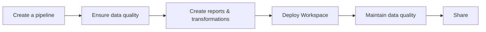

# Introduction

:::info
Looking for the open-source `dlt` library documentation? See the [dlt docs](../../intro.md).
:::

:::note
Use of the dltHub platform and toolkits is subject to a commercial [dltHub License](../license.md).
:::

## Quickstart

```sh
uvx dlthub-start@latest
```

Scaffolds a local workspace with the dltHub AI Workbench, example pipelines, and `dlt[hub]` installed. See [installation](installation.md) for prerequisites and alternative install paths.

## What is dltHub?

dltHub is an agent-native data engineering platform for building, running, and operating production-grade data pipelines. The toolchain is designed to be driven from coding agents — Claude Code, Codex, and Cursor — through [scaffolding commands](../ingestion/init.md) and [per-source context files](../ingestion/rest-api-source.md). A developer or analyst comfortable with Python and a coding agent can build and operate ingestion, [transformations](../transformations/index.md), [quality checks](../data-quality/index.md), and data apps end-to-end without managing infrastructure.

Context — source schemas, annotations, transformation logic, and run metadata — propagates from the data source through transformations to the serving layer. Downstream tools, dashboards, and agents can reason about upstream intent without re-discovering it.

dltHub is built around the open-source library [dlt](../../intro.md). It reuses the same core concepts ([sources](../../general-usage/source.md), [destinations](../../general-usage/destination.md), [pipelines](../../general-usage/pipeline.md)) and extends the extract-and-load focus of `dlt` with:

* [Agent-native developer experience](../ingestion/rest-api-source.md)
* [Transformations](../transformations/index.md)
* [Data quality](../data-quality/index.md)
* [Managed infrastructure for pipelines and data apps](../pipeline-operations/overview.md)
* [Observability](../ingestion/dashboard.md) for pipelines and data apps

dltHub supports both local and managed cloud development. From a [dltHub Workspace](./installation.md#what-is-a-dlthub-workspace), with isolated [profiles](../pipeline-operations/profiles.md) for `dev`, `prod`, and `access` environments, a single developer can deploy and operate pipelines, transformations, and notebooks with a single command. The [platform](../pipeline-operations/overview.md), [workspace dashboard](../ingestion/dashboard.md), and validation tools provide monitoring, troubleshooting, and reliability across the full data workflow:



On dltHub, users can:

* Build and customize data pipelines quickly, optionally delegating boilerplate to a coding agent
* Maintain data quality through declarative checks, tests, and alerts
* Deliver up-to-date dashboards, reports, and data apps
* Scale data workflows without manually managing infrastructure, schema drift, or silent failures

:::tip
For an end-to-end walkthrough, watch the [dltHub demo](https://youtu.be/rmpiFSCV8aA), take the [dltHub agentic data engineering course](https://dlthub.learnworlds.com/course/agentic-data-engineering), or sign in to the [dltHub platform](https://app.dlthub.com) to deploy a workspace.
:::

To get started quickly, follow the [installation instructions](installation.md).

## Design principles

dltHub is designed around three principles:

- **Transparent and context-aware.** Pipelines, sources, and transformations are plain Python you can inspect, customize, and extend — no black-box abstractions. [Schemas](../../general-usage/schema.md), annotations, run metadata, and traces propagate from the data source through transformations to the serving layer, so both developers and agents can reason about upstream intent and downstream impact without re-deriving it from prompts
- **Modular and composable.** [Sources](../../general-usage/source.md), [destinations](../../general-usage/destination.md), [transformations](../transformations/index.md), and platform components are independent building blocks. Adopt only the parts you need and integrate the rest with the surrounding ecosystem ([dbt](../transformations/dbt-transformations.md), Ibis, [marimo](../../general-usage/dataset-access/marimo.md), Streamlit, your own destinations)
- **Agent guardrails with humans in the loop.** Agent-driven workflows include explicit checkpoints — sample runs, generated-code inspection, redacted-secrets commands — so AI-assisted development stays observable and reviewable. Deterministic tooling is used wherever probabilistic behavior is not reliable enough (for example, secrets handling)

## Capabilities

dltHub covers the end-to-end data workflow. Features marked _in public preview_ are broadly available with mature documentation and intended for real workloads, but are not yet fully hardened — expect occasional minor breaking changes. For upcoming features see the [dltHub roadmap](https://dlthub.com/roadmap).

### [Ingestion pipeline development](../ingestion/init.md)

Build extract-and-load pipelines from REST APIs, SQL databases, cloud storage, and Python data structures, with schema inference, normalization, and incremental loading provided by the underlying `dlt` library.

* [Workspace scaffolding](../ingestion/init.md) — initialize a project structure that fits how `dlt` pipelines are developed and deployed
* [AI workbench (agent-native workflow)](../ingestion/rest-api-source.md) — generate REST API, SQL database, and filesystem pipelines from prompts using ingestion development toolkits
* [Premium destinations](../ingestion/iceberg.md) — load to Iceberg lakehouses, [Delta Lake](../ingestion/delta.md), [Snowflake Plus](../ingestion/snowflake-plus.md), or [MS SQL with change tracking](../ingestion/ms-sql.md)

### [Transformation pipeline development](../transformations/index.md)

Write transformations alongside your ingestion pipelines so they share datasets, schemas, and deployment. Source context — annotations, types, and lineage — carries into transformations and on to the serving layer.

* [`@dlt.hub.transformation`](../transformations/index.md) (in public preview) — Python-decorated transformations that run as part of your pipeline graph
* [AI workbench transformation toolkit](../transformations/explore-and-transform.md) (in public preview) — generate and refactor Python and SQL transformations from prompts driven by business ontologies
* [dbt integration](../transformations/dbt-transformations.md) — run dbt projects with a local cache, schema enforcement, and integrated debugging

### [Pipeline operations](../pipeline-operations/overview.md)

Deploy, schedule, and monitor pipelines, transformations, and notebooks without standing up infrastructure.

* [dltHub platform](../pipeline-operations/overview.md)—one-command deploy of an entire workspace, with cron and event-driven [triggers](../pipeline-operations/triggers.md), follow-up chains, freshness checks, and refresh cascades. Sign in at [app.dlthub.com](https://app.dlthub.com)
* [Profiles](../pipeline-operations/profiles.md) and [regions](../platform-capabilities/regions.md)—isolate `dev`, `prod`, and `access` configurations and credentials, and choose where your data plane runs
* [Workspace dashboard & monitoring](../ingestion/dashboard.md)—observe runs, schemas, and lineage from a single UI; stream logs and [diagnose failures](../pipeline-operations/monitoring.md) from the CLI or Web UI

### [Data quality & governance](../data-quality/index.md)

Catch data issues before they reach consumers and keep schemas controlled as sources change.

* [Data quality checks](../data-quality/index.md) (in public preview) — declarative correctness rules with actionable failure messages
* [Advanced quality features](../data-quality/advanced.md) (in public preview) — author and run tests against your datasets as part of a pipeline

### [Data discovery & serving](../data-discovery/datasets.md)

Make loaded data accessible to stakeholders through notebooks, dashboards, and shareable links. Source schemas and transformation context are available here so agents and consumers see the same upstream metadata that drove ingestion.

* [Datasets](../data-discovery/datasets.md) — typed Python and SQL access to loaded data
* [Marimo notebooks](../../general-usage/dataset-access/marimo.md) — build lightweight, shareable data apps
* Public links for interactive jobs — share notebooks and dashboards externally without granting platform access

### [Platform capabilities](../platform-capabilities/regions.md)

Foundations that the rest of the platform builds on.

* GitHub OAuth, Google OAuth, email signup, and API key authentication, with organization and workspace [roles](../platform-capabilities/users-and-roles.md)
* [Managed, multi-tenant runtime](../pipeline-operations/overview.md) with upgrades and patching handled for you
* [Secure secrets management](../platform-capabilities/settings.md) per [profile](../pipeline-operations/profiles.md)

## Pricing and licensing

For current plan details and pricing, see the [dltHub pricing page](https://dlthub.com/pricing). Use of the dltHub platform and toolkits is governed by the [dltHub License](../license.md).


