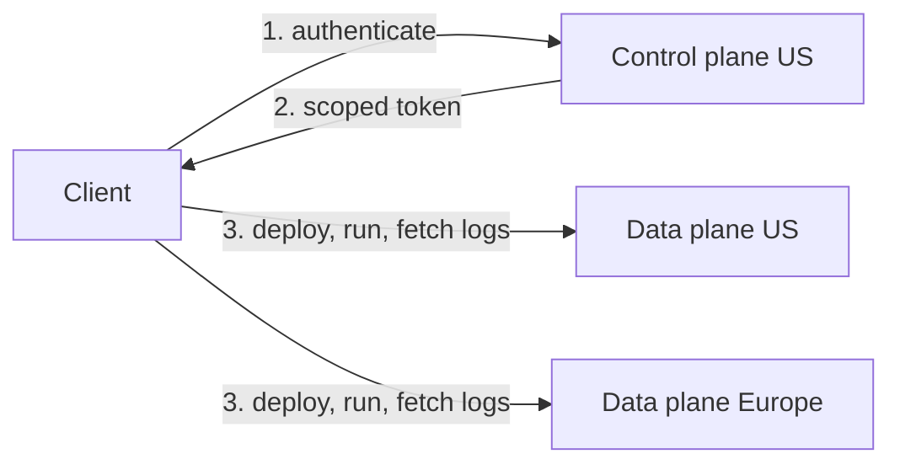

# Regions and data residency

The dltHub platform is architected as a control plane paired with one or more regional data planes. Each organization is assigned to a data region (currently US or Europe), which determines where your code, configuration, secrets, and workload data are processed and stored.

## Architecture

- The control plane is hosted in the US and is shared across all organizations.
- A data plane operates in the selected supported region. Every organization is bound to exactly one data plane.

### What the control plane handles

The control plane is responsible for:

- User and organization management
- Authorization and permissions
- Orchestration metadata — what jobs exist, when they should run, and the status of past runs

The control plane does not store:

- Uploaded user code
- Deployment payloads
- Workspace configuration values
- Workspace secrets

These reside exclusively in the organization's data plane.

### What a data plane handles

A regional data plane:

- Executes batch and interactive jobs
- Stores deployment artifacts (code and configuration) for organizations in that region
- Holds workspace secrets used by jobs at runtime
- Persists workload outputs and metadata generated by your jobs

## How regional isolation is enforced

The dltHub platform uses scoped tokens to ensure that user data only ever touches the organization's selected region:

1. The client (CLI or dashboard) authenticates against the control plane.
2. The control plane issues a scoped token tied to the target organization and its region.
3. The client uses that token to communicate directly with the regional data plane for all operations involving user data — deployments, runs, secrets, and logs.

As a result, code, deployment configuration, and secrets are transmitted to and stored only within the organization's selected region. The control plane never relays them.

## Choosing a region

You select a region when creating an organization, either during `dlthub login` or via the dashboard.

:::caution
An organization's region is permanent and cannot be changed after creation. To run workloads in a different region, create a new organization in the target region and redeploy with `dlthub deploy`.
:::

## Current limitations

### Log routing

Workload execution remains in the selected data plane. However, workload output streams — `stdout` and `stderr` — currently transit through the US region en route to the dashboard and the `dlthub job logs` command. This applies to all regions, including EU workspaces.

For this reason, avoid emitting sensitive data in logs while running on dltHub:

- Secrets and credentials
- Personally identifiable information (PII)
- Regulated data fields (personal health information (PHI), financial identifiers, etc.)
- Secrets

Unhandled exceptions may also leak sensitive context through stack traces, depending on your application and the libraries it uses. Catch and sanitize exceptions in code paths that handle sensitive values.

We are developing a self-contained logging path that will keep log transit fully within the selected region. This page will be updated once that change is released.

## See also

- [dltHub platform overview](overview.md)
- [Profiles in dltHub](../core-concepts/profiles-dlthub.md)
